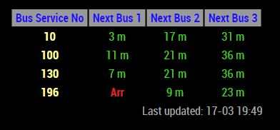

# MMM-SGBusTimings
MagicMirror Module to show Bus arrival timings at a Bus Stop in Singapore

## Screenshot


## Installation
```
cd ~/MagicMirror/modules
git clone https://github.com/eouia/MMM-SGBusTimings
cd MMM-SGBusTimings
npm install
```
## DataMall Singapore API Key
You will need to get API key for dataMall API which you can get here...
https://www.mytransport.sg/content/mytransport/home/dataMall/dynamic-data.html
* Request API Access.
* Save the API key, it will be used for configuration later. 

# Configuration
```
{
    		module: "MMM-SGBusTimings",
    		position: "top_center",
    		config: {
			  apiKey:"YOUR_DATAMALL_KEY",
			  busStopCode:"03111",
    		busServiceNos: ["10", "100","130","196"]
    		}
},
```
* Replace **YOUR_DATAMALL_KEY** with your DataMall API key you received.
* Replace **busStopCode** with the Bus Stop Code you are interested in. Each bus stop code is mentioned on signboards at Bus Stops in Singapore.
* Replace **busServiceNos** with the bus service numbers you are interested to see timings for.
* Add configuration for your module in *config.js* of Magic Mirror

